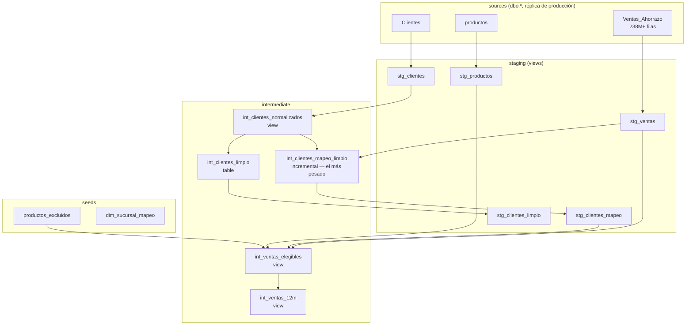
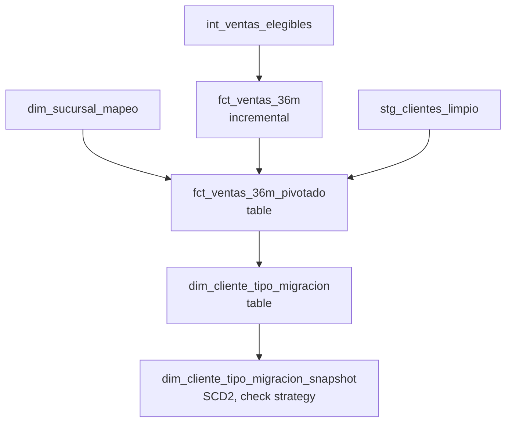
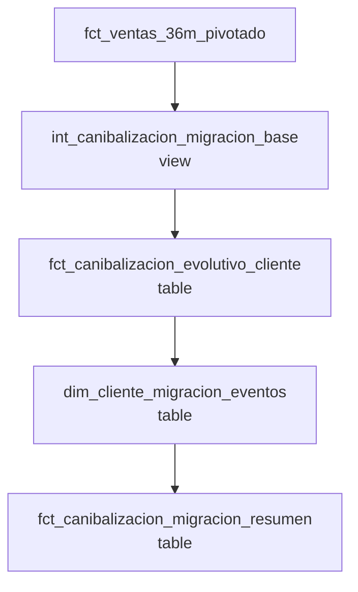
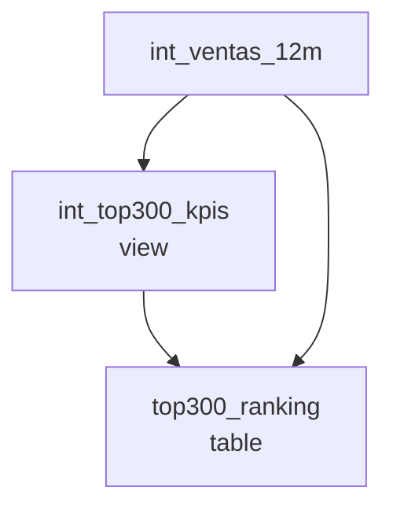
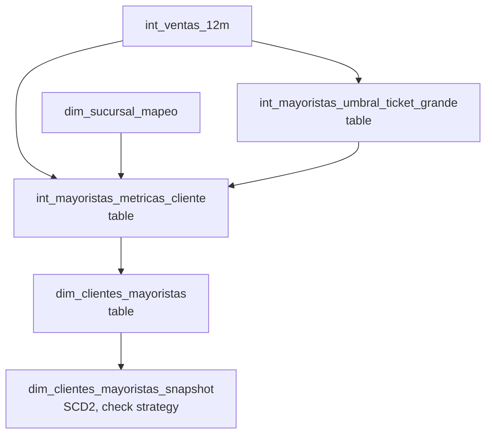

# Arquitectura de dependencias — dbt_ahorrazo

## Qué es esto, en una vista de portfolio

`dbt_ahorrazo` es la capa de transformación de datos **compartida** por
3 iniciativas de negocio de Ahorrazo que antes vivían como pipelines
Python/notebook separados y duplicaban las mismas reglas:

| Proyecto | Qué responde | Mart principal |
|---|---|---|
| **Canibalización de sucursales** | ¿Un cliente que compra en una sucursal nueva es cliente nuevo, o se lo "robamos" a otra sucursal propia? | `dim_cliente_tipo_migracion` (v1) / `fct_canibalizacion_migracion_resumen` (v3, en validación) |
| **Top 300 Productos** | ¿Cuáles son los productos más importantes del catálogo, por sucursal? | `top300_ranking` |
| **Clientes Mayoristas** | ¿Qué clientes compran a escala mayorista y con qué nivel? | `dim_clientes_mayoristas` |

Los 3 leen las mismas tablas base en SQL Server (`Ventas_Ahorrazo`
238M+ filas, `Clientes`, `productos`) — antes cada proyecto tenía su
propia versión, ligeramente distinta, de "qué es una venta válida" o
"qué es un cliente limpio". Este repo resuelve esa lógica **una sola
vez** (capa `staging`/`intermediate` de abajo) y cada proyecto arma su
mart específico encima vía `ref()`. Se orquesta con Airflow, sumado al
Airflow dockerizado que ya opera el equipo de Stock en el mismo
Windows Server (repo separado `orquestacion_ahorrazo`, ver
"Orquestación" más abajo) — DAGs propios, independientes de los de
Stock.

Estado general y por qué existe cada decisión: [`README.md`](README.md)
(setup, convenciones) · [`PENDIENTES.md`](PENDIENTES.md) (estado
comando por comando, siempre lo más actualizado) ·
[`../PLAN_MAESTRO_REINGENIERIA.md`](../PLAN_MAESTRO_REINGENIERIA.md)
(diagnóstico y plan completo a nivel portfolio).

## Diagramas de dependencias

Armados leyendo el código actual modelo por modelo (no a mano/de
memoria).

Para el lineage interactivo y siempre-actualizado (se desactualiza este
documento si el código cambia y nadie lo actualiza acá), `dbt docs
generate` + `dbt docs serve` es la fuente definitiva. Esto es la versión
legible y versionada en git para onboarding y referencia rápida sin
tener que levantar nada.

---

## Capa base compartida

Todo lo de acá abajo lo consumen los 3 proyectos — un cambio acá se
propaga automáticamente a los 3 vía `ref()`, sin volver a escribir la
regla en cada uno (ese es el punto de tener un solo repo dbt, ver
`PLAN_MAESTRO_REINGENIERIA.md` §2).

### Por qué `staging` es `view` y no `table`

No computa nada caro (cast de tipos, rename, filtros simples) -- el
cómputo caro (joins, ventanas, agregaciones) vive en
`intermediate`/`marts`, que sí son `table`/`incremental`. Materializar
`stg_ventas` como tabla duplicaría una fact de 238M+ filas para guardar
exactamente el mismo dato. Una vista además nunca queda desactualizada
-- se resuelve en el momento contra la fuente real, sin un paso de
"refresh" que alguien se pueda olvidar de correr.

### Por qué existe `staging` y no se va directo a `intermediate`

- Es el **único punto de contacto con `source()`** de todo el proyecto
  -- todo lo demás usa `ref()`. Si una fuente cruda cambia de forma, hay
  un solo lugar que actualizar.
- La limpieza básica (tipos, nombres, collation) se resuelve **una sola
  vez** -- ejemplo real: `producto_id` casteado a `varchar(100)` acá
  evita que cada modelo de `intermediate` tenga que acordarse de
  castear por su cuenta (la misma clase de duplicación que esta
  migración a dbt vino a resolver).
- Es donde anclan los `contract` (`stg_ventas`/`stg_productos`) -- un
  solo punto de entrada confiable, en vez de necesitar un contract por
  cada modelo que tocara la fuente cruda directo.
- Detecta roturas de la fuente rápido y en el lugar correcto: un
  `SELECT` simple falla obvio, en vez de esconderse dentro de un modelo
  intermedio con varios JOINs y lógica de negocio alrededor.



**`int_ventas_elegibles`** es la única fuente de verdad de "qué es una
venta válida para análisis" (empresa=3, exclusión de categorías
bolsa/egre/servi, cliente de test, productos de `productos_excluidos`) —
la consumen directo o indirecto los 3 proyectos.

**`int_ventas_12m`** es la ventana móvil de 12 meses (meses cerrados)
compartida entre Top 300 y Mayoristas — no existía como pieza separada
en el diseño original, se extrajo al detectar que los dos la
recalculaban por separado.

### Orden de ejecución de esta capa

1. Sources — nada que ejecutar, es la base replicada.
2. `stg_ventas`, `stg_productos`, `stg_clientes` — en paralelo entre sí.
3. `int_clientes_normalizados`.
4. `int_clientes_mapeo_limpio` (incremental, **47–67 min en
   `--full-refresh`**, el cuello de botella real del proyecto) e
   `int_clientes_limpio` — en paralelo entre sí.
5. `stg_clientes_mapeo`, `stg_clientes_limpio` — en paralelo entre sí.
6. `int_ventas_elegibles` (necesita `stg_ventas` + `stg_clientes_mapeo` +
   `stg_productos` + seed `productos_excluidos`).
7. `int_ventas_12m`.

---

## Canibalización



### Orden de ejecución
```
dbt build --select +dim_cliente_tipo_migracion
dbt snapshot --select dim_cliente_tipo_migracion_snapshot
```
(el `+` resuelve `fct_ventas_36m` → `fct_ventas_36m_pivotado` →
`dim_cliente_tipo_migracion` solo, ver nota general abajo)

### Canibalización v3 (eventos de migración) — vía paralela, no reemplaza lo de arriba

Metodología distinta a `dim_cliente_tipo_migracion` (ventana de 24
meses, eventos de migración por sucursal en vez de acumulado corrido) —
portada de `canibalizacion_v3.py`, preservando 2 comportamientos no
obvios del código original (ver el comentario en
`dim_cliente_migracion_eventos.sql` para el detalle). Sin confirmar
todavía contra la base real.



### Orden de ejecución
```
dbt build --select +fct_canibalizacion_migracion_resumen
```

---

## Top 300 Productos



### Orden de ejecución
```
dbt build --select +top300_ranking
```

---

## Clientes Mayoristas



### Orden de ejecución
```
dbt build --select +dim_clientes_mayoristas
dbt snapshot --select dim_clientes_mayoristas_snapshot
```

---

## Cómo se ejecuta esto en la práctica

En el día a día **no hace falta memorizar ni escribir el orden a
mano**: `dbt build --select +<modelo>` resuelve el grafo de dependencias
solo, seeds incluidos. Los diagramas de arriba son para *entender* el
grafo (qué depende de qué, dónde está el cuello de botella real), no un
procedimiento manual paso a paso.

**Para reconstruir todo el proyecto de una vez** (los 3 proyectos + la
capa base + los 2 snapshots, en el orden correcto):
```
dbt build
```

### Lo que dbt NO resuelve solo

- **`--full-refresh` es siempre explícito, nunca automático.** Los 2
  modelos incrementales (`int_clientes_mapeo_limpio`, `fct_ventas_36m`)
  solo reprocesan su ventana de lookback en una corrida normal. Si
  cambia una regla que afecta datos históricos ya cargados (pasó al
  migrar `fct_ventas_36m` a `int_ventas_elegibles`), hace falta
  `--full-refresh` puntual sobre ese modelo — dbt no lo detecta ni lo
  sugiere.
- **Los snapshots no corren dentro de `dbt build` si se los selecciona
  aparte** — `dbt build` sin selector sí los incluye al final, pero
  `dbt build --select +dim_cliente_tipo_migracion` no los toca; hace
  falta `dbt snapshot --select ...` explícito. Y `dbt snapshot
  --full-refresh` **borra toda la historia acumulada** — nunca usarlo
  salvo que sea intencional.
- **`dbt source freshness`** (alerta de datos desactualizados sobre
  `Ventas_Ahorrazo`, `warn_after: 7 días`, ver
  `models/staging/_staging__sources.yml`) no corre dentro de `dbt
  build` ni `dbt snapshot` — es un comando aparte. Automatizado vía
  `dbt_ahorrazo_diario` (ver "Orquestación" abajo).
- **Cuando se mueve un objeto de schema** (pasó con la restructuración a
  `staging`/`intermediate`/`marts_*`), cualquier modelo no reconstruido
  desde el cambio "no existe" en su ubicación nueva aunque exista en la
  vieja — un `dbt build` sin selector, corrido una vez, resuelve esto de
  raíz para todo el proyecto.

---

## Orquestación (Airflow)

El único Airflow del server es el dockerizado del equipo de Stock
(`stock_dato/ahorrazo/`). Sales no tiene un Airflow propio -- se suma al
mismo, vía volúmenes adicionales en su `docker-compose.yml`, con DAGs
**propios e independientes** (repo `orquestacion_ahorrazo`, sibling de
este repo) -- no encadenados al `dag_orquestador` de Stock ni a su
lógica de retry/email.

| DAG | Qué corre | Horario (UTC) | Por qué ese horario |
|---|---|---|---|
| `dbt_ahorrazo_mensual` | `dim_clientes_mayoristas` + su snapshot | Día 1, 02:00 | Más margen -- Mayoristas es el más nuevo, sin tiempo real medido |
| `dbt_ahorrazo_semanal` | `dim_cliente_tipo_migracion` + su snapshot, `top300_ranking` | Lunes, 04:00 | `dbt build` completo mide ~1h30 (dato real) |
| `dbt_ahorrazo_diario` | `dbt source freshness` | Todos los días, 05:30 | Liviano, corre en segundos |

Los 3 terminan bien antes de las 07:00 UTC, cuando arranca el
`dag_orquestador` de Stock (ETL → diarias → semanales, con timeouts de
hasta 3-4h cada uno).

**Pool `dbt_ahorrazo_serial`** (1 slot, ya creado): las tareas de
`dbt_ahorrazo_semanal` y `dbt_ahorrazo_mensual` lo comparten, para que
nunca corran al mismo tiempo entre sí -- cubre el caso de que el día 1
del mes caiga lunes.

**Canibalización v3** (`fct_canibalizacion_migracion_resumen`) todavía
no está en ningún DAG -- se agenda recién cuando esté confirmada contra
la base real (ver más arriba).

Cómo invocan `dbt` las tareas: cada una es un `PythonOperator` que llama
a un `main()` de `scripts/dbt_ahorrazo/` (mismo patrón que ya usan las
tareas de Stock) -- que a su vez corre `dbt` vía `subprocess` contra un
venv Linux propio, separado del Python de Airflow (nunca se instaló
`dbt-core` en el `requirements.txt` de Stock).
