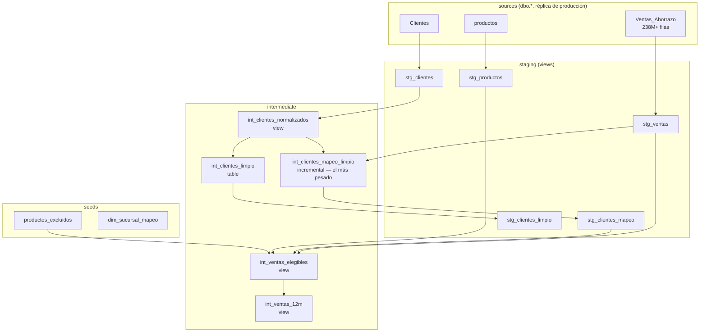
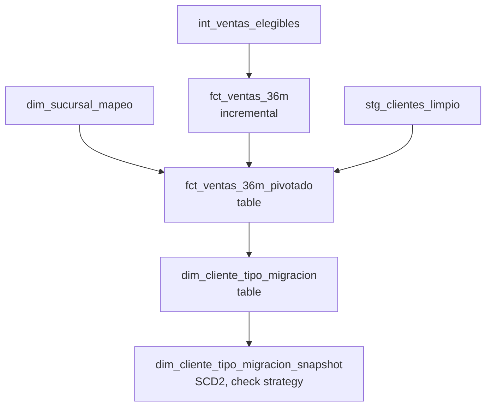
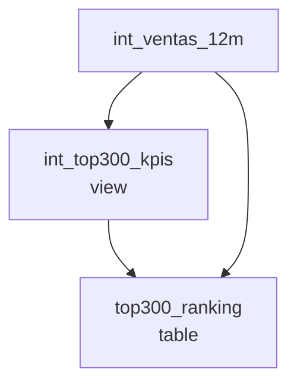
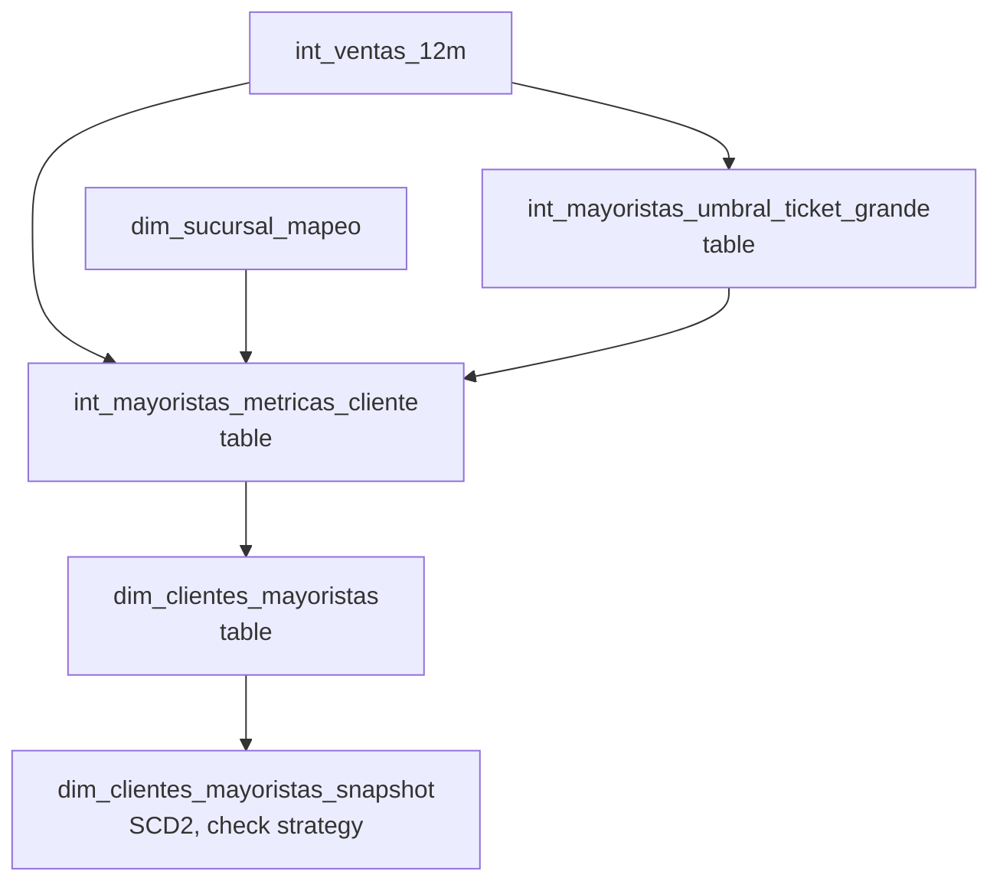

# Arquitectura de dependencias — dbt_ahorrazo

Diagramas de dependencias (`ref()`/`source()`) y orden de ejecución del
proyecto, armados leyendo el código actual modelo por modelo (no a
mano/de memoria). Ver `PENDIENTES.md` para qué está confirmado contra la
base real hoy y qué sigue pendiente.

Para el lineage interactivo y siempre-actualizado (se desactualiza este
documento si el código cambia y nadie lo actualiza acá), `dbt docs
generate` + `dbt docs serve` es la fuente definitiva. Esto es la versión
legible y versionada en git para onboarding y referencia rápida sin
tener que levantar nada.

---

## Capa base compartida

Todo lo de acá abajo lo consumen los 3 proyectos — un cambio acá se
propaga automáticamente a los 3 vía `ref()`, sin volver a escribir la
regla en cada uno (ese es el punto de tener un solo repo dbt, ver
`PLAN_MAESTRO_REINGENIERIA.md` §2).



**`int_ventas_elegibles`** es la única fuente de verdad de "qué es una
venta válida para análisis" (empresa=3, exclusión de categorías
bolsa/egre/servi, cliente de test, productos de `productos_excluidos`) —
la consumen directo o indirecto los 3 proyectos.

**`int_ventas_12m`** es la ventana móvil de 12 meses (meses cerrados)
compartida entre Top 300 y Mayoristas — no existía como pieza separada
en el diseño original, se extrajo al detectar que los dos la
recalculaban por separado.

### Orden de ejecución de esta capa

1. Sources — nada que ejecutar, es la base replicada.
2. `stg_ventas`, `stg_productos`, `stg_clientes` — en paralelo entre sí.
3. `int_clientes_normalizados`.
4. `int_clientes_mapeo_limpio` (incremental, **47–67 min en
   `--full-refresh`**, el cuello de botella real del proyecto) e
   `int_clientes_limpio` — en paralelo entre sí.
5. `stg_clientes_mapeo`, `stg_clientes_limpio` — en paralelo entre sí.
6. `int_ventas_elegibles` (necesita `stg_ventas` + `stg_clientes_mapeo` +
   `stg_productos` + seed `productos_excluidos`).
7. `int_ventas_12m`.

---

## Canibalización



### Orden de ejecución
```
dbt build --select +dim_cliente_tipo_migracion
dbt snapshot --select dim_cliente_tipo_migracion_snapshot
```
(el `+` resuelve `fct_ventas_36m` → `fct_ventas_36m_pivotado` →
`dim_cliente_tipo_migracion` solo, ver nota general abajo)

---

## Top 300 Productos



### Orden de ejecución
```
dbt build --select +top300_ranking
```

---

## Clientes Mayoristas



### Orden de ejecución
```
dbt build --select +dim_clientes_mayoristas
dbt snapshot --select dim_clientes_mayoristas_snapshot
```

---

## Cómo se ejecuta esto en la práctica

En el día a día **no hace falta memorizar ni escribir el orden a
mano**: `dbt build --select +<modelo>` resuelve el grafo de dependencias
solo, seeds incluidos. Los diagramas de arriba son para *entender* el
grafo (qué depende de qué, dónde está el cuello de botella real), no un
procedimiento manual paso a paso.

**Para reconstruir todo el proyecto de una vez** (los 3 proyectos + la
capa base + los 2 snapshots, en el orden correcto):
```
dbt build
```

### Lo que dbt NO resuelve solo

- **`--full-refresh` es siempre explícito, nunca automático.** Los 2
  modelos incrementales (`int_clientes_mapeo_limpio`, `fct_ventas_36m`)
  solo reprocesan su ventana de lookback en una corrida normal. Si
  cambia una regla que afecta datos históricos ya cargados (pasó al
  migrar `fct_ventas_36m` a `int_ventas_elegibles`), hace falta
  `--full-refresh` puntual sobre ese modelo — dbt no lo detecta ni lo
  sugiere.
- **Los snapshots no corren dentro de `dbt build` si se los selecciona
  aparte** — `dbt build` sin selector sí los incluye al final, pero
  `dbt build --select +dim_cliente_tipo_migracion` no los toca; hace
  falta `dbt snapshot --select ...` explícito. Y `dbt snapshot
  --full-refresh` **borra toda la historia acumulada** — nunca usarlo
  salvo que sea intencional.
- **`dbt source freshness`** (alerta de datos desactualizados sobre
  `Ventas_Ahorrazo`, `warn_after: 7 días`, ver
  `models/staging/_staging__sources.yml`) no corre dentro de `dbt
  build` ni `dbt snapshot` — es un comando aparte, sin automatizar
  todavía (tarea de Fase 5/Airflow).
- **Cuando se mueve un objeto de schema** (pasó con la restructuración a
  `staging`/`intermediate`/`marts_*`), cualquier modelo no reconstruido
  desde el cambio "no existe" en su ubicación nueva aunque exista en la
  vieja — un `dbt build` sin selector, corrido una vez, resuelve esto de
  raíz para todo el proyecto.
