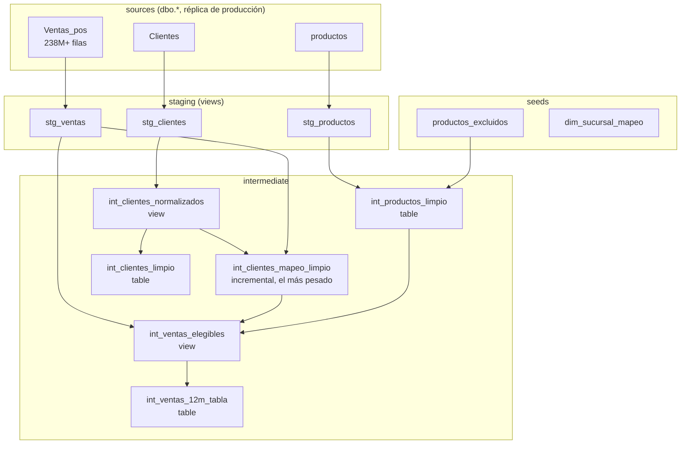
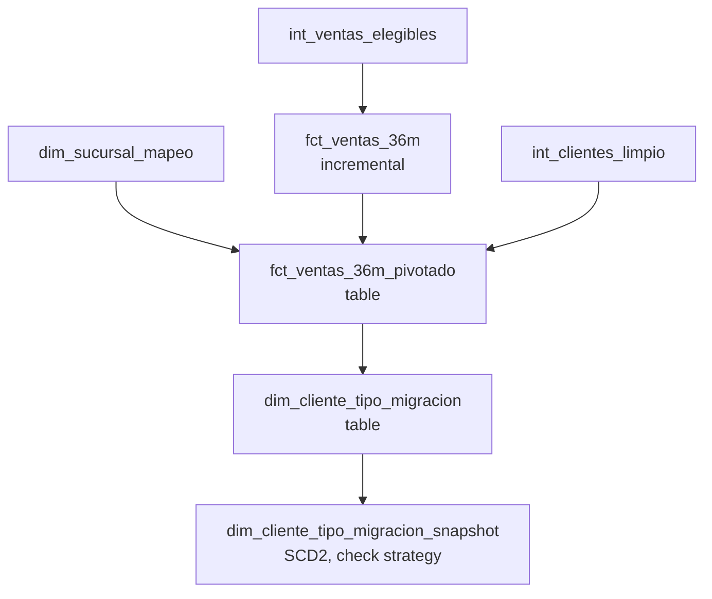
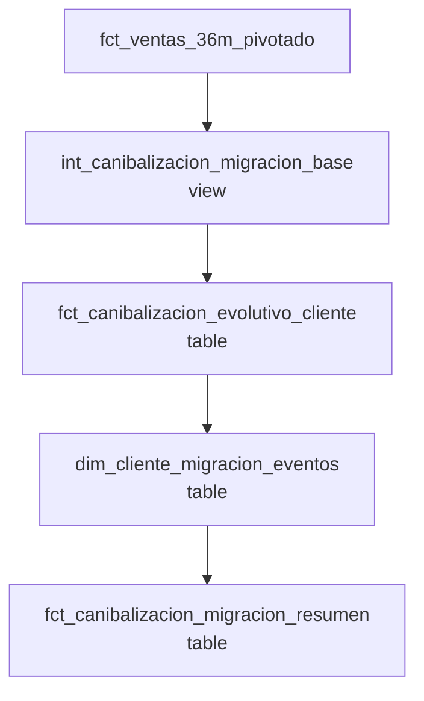
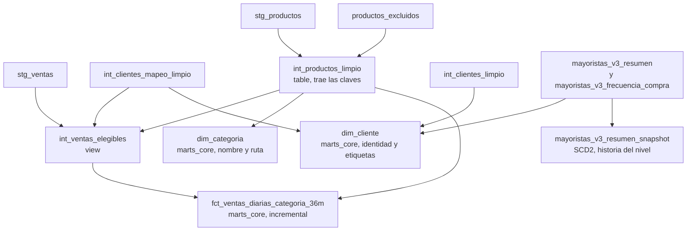
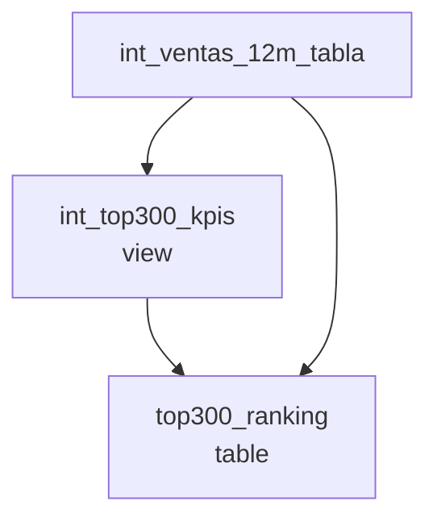
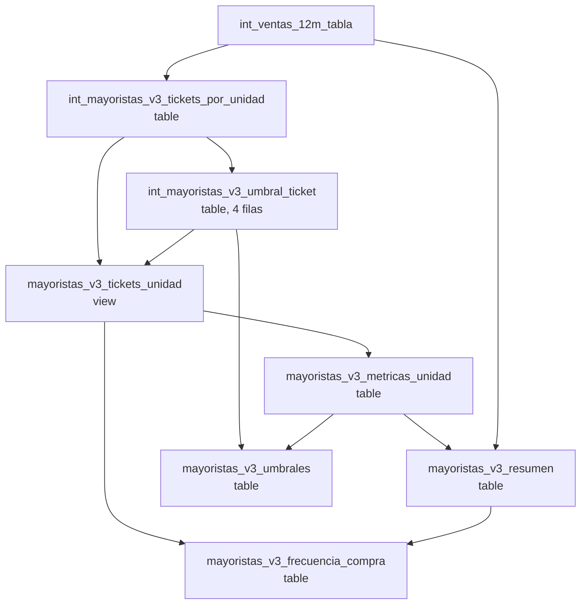

# Arquitectura de dependencias

## Los tres proyectos

`dbt_ahorrazo` es la capa de transformación que comparten los tres proyectos de
datos de Ahorrazo. Cada uno vivía antes como un pipeline propio de Python y
notebooks, con su propia copia de las mismas reglas.

| Proyecto | Qué responde | Mart principal |
|---|---|---|
| **Canibalización de sucursales** | ¿Un cliente que compra en una sucursal nueva es cliente nuevo, o se lo "robamos" a otra sucursal propia? | `dim_cliente_tipo_migracion` (v1) y `fct_canibalizacion_migracion_resumen` (v3) |
| **Top 300 Productos** | ¿Cuáles son los productos más importantes del catálogo, por sucursal? | `top300_ranking` |
| **Clientes Mayoristas** | ¿Qué clientes compran a escala mayorista y con qué nivel? | `mayoristas_v3_resumen` |

Los tres leen las mismas tablas base en SQL Server: `Ventas_pos`, `Clientes` y
`productos`. `Ventas_pos` reemplaza desde el 20/10/2026 a `Ventas_Ahorrazo`, que
tenía más de 238 millones de filas y quedó deprecada; las cifras de volumen de
este documento son de esa tabla. Cada proyecto tenía su propia
definición, ligeramente distinta, de qué es una venta válida y de qué es un
cliente limpio. Acá esa lógica se resuelve una sola vez, en las capas `staging` e
`intermediate`, y cada proyecto arma su mart encima con `ref()`. Se orquesta con Airflow, sumado al
Airflow dockerizado que ya opera el equipo de Stock en el mismo
Windows Server (repo separado `orquestacion_ahorrazo`, ver
"Orquestación" más abajo), con DAGs propios, independientes de los de
Stock.

El setup y las convenciones están en [`README.md`](README.md), y los comandos de
uso diario en [`COMANDOS.md`](COMANDOS.md).

## Diagramas de dependencias

Armados leyendo el código modelo por modelo.

Este documento se desactualiza si alguien cambia el código y no lo
actualiza acá. Para el lineage siempre al día, `dbt docs generate` y
`dbt docs serve` son la fuente definitiva. Esto es la versión legible y
versionada en git, para leer sin levantar nada.

---

## Capa base compartida

Todo lo de acá abajo lo consumen los tres proyectos, así que un cambio acá se
propaga a los tres vía `ref()`, sin volver a escribir la regla en cada uno. Es el
motivo de tener un solo repo dbt en lugar de tres.

### Cómo se materializa cada capa

Elegir entre vista y tabla es elegir dónde se paga el costo. Una vista no ocupa
espacio y devuelve siempre el dato actual, pero vuelve a ejecutar su consulta en
cada lectura. Una tabla se calcula una vez y después se lee barato, a cambio de
ocupar espacio y de quedar congelada hasta la próxima corrida.

La decisión se toma modelo por modelo, con dos preguntas: cuánto cuesta calcular
el resultado, y cuántas veces se lo va a leer.

**`staging` va como vista.** Cada modelo devuelve una fila por cada fila de la
fuente y solo cambia nombres de columna, tipos y algún filtro simple. Calcularlo
cuesta prácticamente lo mismo que leer la tabla original, así que resolverlo en
cada lectura no agrega trabajo. Materializar `stg_ventas` guardaría una segunda
copia de 238 millones de filas con exactamente el mismo contenido, y agregaría un
paso de actualización que puede quedar atrasado respecto de la fuente.

**`marts` va como tabla.** Un mart es el resultado de joins, ventanas y
agregaciones sobre millones de filas, y lo consultan tableros que se abren varias
veces por día. Calcularlo una vez por corrida y leerlo muchas veces es el reparto
de costo que corresponde. dbt lo construye en una tabla nueva y la intercambia al
final, así que quien esté consultando la tabla anterior no ve un estado
intermedio.

**`intermediate` no tiene una regla única**, y por eso `dbt_project.yml` no le
fija materialización: cada modelo declara la suya. `int_clientes_limpio` es una
dimensión chica que se une contra la fact, y como tabla evita repetir ese trabajo
en cada consumidor. `int_clientes_mapeo_limpio` y `fct_ventas_36m` son
incrementales, porque reconstruirlos enteros lleva entre 47 y 67 minutos y solo
cambian las filas recientes. `int_ventas_12m_tabla` es tabla por un motivo
distinto: su ventana sale del calendario, y una vista se movería sola mientras
las tablas que la consumen quedan congeladas en su última corrida, así que
materializarla las mantiene alineadas.

### Por qué existe `staging` y no se va directo a `intermediate`

- Es el **único punto de contacto con `source()`** de todo el proyecto
  Todo lo demás usa `ref()`. Si una fuente cruda cambia de forma, hay
  un solo lugar que actualizar.
- La limpieza básica (tipos, nombres, collation) se resuelve **una sola
  vez**. Un ejemplo real: `producto_id` casteado a `varchar(100)` acá
  evita que cada modelo de `intermediate` tenga que acordarse de
  castear por su cuenta (la misma clase de duplicación que esta
  migración a dbt vino a resolver).
- Es donde anclan los `contract` de `stg_ventas` y `stg_productos`. Un
  solo punto de entrada confiable, en vez de necesitar un contract por
  cada modelo que tocara la fuente cruda directo.
- Detecta roturas de la fuente rápido y en el lugar correcto: un
  `SELECT` simple falla obvio, en vez de esconderse dentro de un modelo
  intermedio con varios JOINs y lógica de negocio alrededor.


```mermaid
graph TD
    subgraph SRC["sources (dbo.*, réplica de producción)"]
        SRC_VENTAS[Ventas_pos<br/>238M+ filas]
        SRC_PROD[productos]
        SRC_CLI[Clientes]
    end

    subgraph SEEDS["seeds"]
        SEED_EXCL[productos_excluidos]
        SEED_SUC[dim_sucursal_mapeo]
    end

    subgraph STG["staging (views)"]
        STG_VENTAS[stg_ventas]
        STG_PROD[stg_productos]
        STG_CLI[stg_clientes]
    end

    subgraph INT["intermediate"]
        INT_NORM[int_clientes_normalizados<br/>view]
        INT_MAPEO[int_clientes_mapeo_limpio<br/>incremental, el más pesado]
        INT_LIMPIO[int_clientes_limpio<br/>table]
        INT_PROD[int_productos_limpio<br/>table]
        INT_ELEG[int_ventas_elegibles<br/>view]
        INT_12M_T[int_ventas_12m_tabla<br/>table]
    end

    SRC_VENTAS --> STG_VENTAS
    SRC_PROD --> STG_PROD
    SRC_CLI --> STG_CLI

    STG_CLI --> INT_NORM
    INT_NORM --> INT_MAPEO
    STG_VENTAS --> INT_MAPEO
    INT_NORM --> INT_LIMPIO

    STG_PROD --> INT_PROD
    SEED_EXCL --> INT_PROD

    STG_VENTAS --> INT_ELEG
    INT_MAPEO --> INT_ELEG
    INT_PROD --> INT_ELEG

    INT_ELEG --> INT_12M_T
```

**`int_ventas_elegibles`** es la única fuente de verdad de "qué es una
venta válida para análisis" (empresa=3, exclusión de categorías
bolsa/egre/servi, cliente de test, productos de `productos_excluidos`):
la consumen directo o indirecto los 3 proyectos.

**`int_productos_limpio`** es el catálogo de productos elegibles (empresa 3, sin
bolsas, egresos, servicios, activos, insumos ni los productos de
`productos_excluidos`), con las categorías ya resueltas. `int_ventas_elegibles`
une contra él en lugar de repetir el filtro. Trae además una clave por categoría
en cada uno de los cuatro niveles.

Las claves de categoría se leen en `marts_core.dim_categoria`; ver la sección de la
capa core más abajo.

**`int_ventas_12m_tabla`** es la ventana móvil de 12 meses cerrados a grano de
línea, compartida entre Top 300 y Mayoristas, y es lo que consumen los marts y el
tablero de Power BI. Es tabla y no vista porque una vista recalcularía la ventana
contra `getdate()` en cada consulta: el primero de cada mes empezaría a devolver
un período distinto sin que se haya corrido nada, y eso desalinearía las tablas de
`marts_mayoristas`, que guardan la ventana del día en que se construyeron, contra
la venta que ve Power BI. Materializarla además baja de ocho recorridos de la
cadena sobre `dbo.Ventas_pos` por corrida a uno solo. Lee
`int_ventas_elegibles` directo y lista sus columnas: antes había una vista
intermedia con `select *`, y las columnas nuevas no le llegaban hasta correr
`sp_refreshview` a mano.

**`int_ventas_24m_tabla`** es lo mismo con 24 meses, para comparar un año contra
el anterior.

### Orden de ejecución de esta capa

1. Sources. Nada que ejecutar, es la base replicada.
2. `stg_ventas`, `stg_productos` y `stg_clientes`, en paralelo entre sí.
3. `int_clientes_normalizados`.
4. `int_clientes_mapeo_limpio` (incremental, **47–67 min en
   `--full-refresh`**, el cuello de botella real del proyecto) e
   `int_clientes_limpio`, en paralelo entre sí.
5. `int_productos_limpio` (necesita `stg_productos` + seed `productos_excluidos`).
   Después `int_ventas_elegibles` (necesita `stg_ventas` +
   `int_clientes_mapeo_limpio` + `int_productos_limpio`).
6. `int_ventas_12m_tabla`, que es la que consumen los marts.

---

## Canibalización


```mermaid
graph TD
    INT_ELEG[int_ventas_elegibles] --> FCT[fct_ventas_36m<br/>incremental]
    SEED_SUC[dim_sucursal_mapeo] --> PIVOT[fct_ventas_36m_pivotado<br/>table]
    FCT --> PIVOT
    INT_LIMPIO[int_clientes_limpio] --> PIVOT
    PIVOT --> DIM[dim_cliente_tipo_migracion<br/>table]
    DIM --> SNAP[dim_cliente_tipo_migracion_snapshot<br/>SCD2, check strategy]
```

### Orden de ejecución
```
dbt build --select +dim_cliente_tipo_migracion
dbt snapshot --select dim_cliente_tipo_migracion_snapshot
```
(el `+` resuelve `fct_ventas_36m` → `fct_ventas_36m_pivotado` →
`dim_cliente_tipo_migracion` solo, ver nota general abajo)

### Canibalización v3, eventos de migración

Metodología distinta a `dim_cliente_tipo_migracion` (ventana de 24
meses, eventos de migración por sucursal en vez de acumulado corrido):
portada de `canibalizacion_v3.py`, preservando dos comportamientos no obvios del
código original (ver el comentario en `dim_cliente_migracion_eventos.sql`).

El DAG semanal reconstruye solo la cadena de la v1, así que estos cuatro modelos
no los actualiza ninguna corrida programada. Cambiar el selector del DAG a
`+tag:canibalizacion` lo resuelve, y es independiente de decidir el cutover.


```mermaid
graph TD
    PIVOT[fct_ventas_36m_pivotado] --> BASE[int_canibalizacion_migracion_base<br/>view]
    BASE --> EVOL[fct_canibalizacion_evolutivo_cliente<br/>table]
    EVOL --> EVT[dim_cliente_migracion_eventos<br/>table]
    EVT --> RES[fct_canibalizacion_migracion_resumen<br/>table]
```

### Orden de ejecución
```
dbt build --select +fct_canibalizacion_migracion_resumen
```

---

## Capa core

Las entidades y los hechos que comparten varios proyectos, en el schema
`marts_core`. Lo que lee más de un análisis no pertenece a ninguno, y por eso no va
en un mart de proyecto. Hoy tiene la dimensión de clientes, la de categorías y la venta
diaria por categoría.

`dim_cliente` es una fila por cliente, con su identidad y las etiquetas que les ponen
los análisis: el nivel de Mayoristas, el segmento (Mayoristas o Minoristas) y cada
cuánto compra. Incluye a todos los clientes del mapeo, también a los que compran sin
haberse dado nunca de alta en `dbo.Clientes`, que salen como `(sin ficha)`. Está al
final de la cadena: depende de los análisis, y ningún análisis la lee, porque dbt no
puede ordenar dos modelos que se leen entre sí. Los análisis leen la identidad de
`int_clientes_limpio`, que sigue siendo el insumo, y toman las etiquetas de los demás
desde el resultado donde se definen. No trae celular ni mail. Las etiquetas son las
vigentes; la historia de la clasificación de Mayoristas está en un snapshot.

`dim_categoria` es una fila por categoría de cada nivel del catálogo, con su clave,
la clave de su padre y su ruta legible. Existe porque el nombre de una categoría no
la identifica: "Dama" aparece bajo 81 categorías de nivel 3 distintas, y 8 nombres
de nivel 2, 99 de nivel 3 y 324 de nivel 4 se repiten bajo más de un padre. La clave
es el hash de la ruta completa desde la raíz, así que dos categorías con el mismo
nombre y distinto padre tienen claves distintas, y una categoría nueva no mueve las
existentes. Un nivel sin valor es un nodo `(sin asignar)` bajo su padre, de modo que
todo producto tiene clave en los cuatro niveles. Se reconstruye junto con el resto de la
capa core, y queda desactualizada entre corridas cuando el catálogo gana categorías
nuevas.

`fct_ventas_diarias_categoria_36m` es la venta diaria por sucursal y categoría de
nivel 4, sobre una ventana de 36 meses cerrados. No sale de `fct_ventas_36m`, que
está agregada por mes: lee `int_ventas_elegibles`, la venta válida del proyecto, y
toma de `int_productos_limpio` la clave de categoría de cada producto. Trae la clave
de los cuatro niveles, así que la jerarquía completa está en cada fila.


```mermaid
graph TD
    STG_VENTAS[stg_ventas] --> INT_ELEG[int_ventas_elegibles<br/>view]
    INT_MAPEO[int_clientes_mapeo_limpio] --> INT_ELEG
    STG_PROD[stg_productos] --> INT_PROD[int_productos_limpio<br/>table, trae las claves]
    SEED_EXCL[productos_excluidos] --> INT_PROD
    INT_PROD --> INT_ELEG
    INT_PROD --> CAT[dim_categoria<br/>marts_core, nombre y ruta]
    INT_ELEG --> FCT[fct_ventas_diarias_categoria_36m<br/>marts_core, incremental]
    INT_PROD --> FCT
    INT_CLI[int_clientes_limpio] --> CLI[dim_cliente<br/>marts_core, identidad y etiquetas]
    INT_MAPEO --> CLI
    MAYO[mayoristas_v3_resumen<br/>y mayoristas_v3_frecuencia_compra] --> CLI
    MAYO --> SNAP[mayoristas_v3_resumen_snapshot<br/>SCD2, historia del nivel]
```

### Orden de ejecución
```
dbt build --select tag:core
```
Con la capa base y Mayoristas ya construidos, `tag:core` alcanza. La primera vez,
`+fct_ventas_diarias_categoria_36m dim_categoria` construye la venta diaria y la
dimensión de categorías con todo lo que necesitan; `dim_categoria` va explícita
porque la tabla diaria no la referencia y el `+` no la alcanza. El `post_hook` de la
venta diaria borra los días que salen de la ventana, con el mismo corte por calendario
que `fct_ventas_36m`. El detalle está en `models/marts/core/README.md`.

---

## Top 300 Productos


```mermaid
graph TD
    INT_12M[int_ventas_12m_tabla] --> KPIS[int_top300_kpis<br/>view]
    KPIS --> RANK[top300_ranking<br/>table]
    INT_12M --> RANK
```

### Orden de ejecución
```
dbt build --select +top300_ranking
```

---

## Clientes Mayoristas


```mermaid
graph TD
    INT_12M[int_ventas_12m_tabla] --> POR_UNIDAD[int_mayoristas_v3_tickets_por_unidad<br/>table]
    POR_UNIDAD --> CORTE[int_mayoristas_v3_umbral_ticket<br/>table, 4 filas]
    POR_UNIDAD --> TICKETS[mayoristas_v3_tickets_unidad<br/>view]
    CORTE --> TICKETS
    TICKETS --> METRICAS[mayoristas_v3_metricas_unidad<br/>table]
    METRICAS --> RESUMEN[mayoristas_v3_resumen<br/>table]
    INT_12M --> RESUMEN
    CORTE --> UMBRALES[mayoristas_v3_umbrales<br/>table]
    METRICAS --> UMBRALES
    TICKETS --> FREC[mayoristas_v3_frecuencia_compra<br/>table]
    RESUMEN --> FREC
```

`mayoristas_v3_resumen` toma de `int_ventas_12m_tabla` la venta para C3, que
entra con todas las unidades de medida y no solo con las cuatro que tienen
corte de volumen.

`mayoristas_v3_tickets_unidad` es una vista: son las mismas filas que
`int_mayoristas_v3_tickets_por_unidad` con los cortes al lado, y materializarla
guardaría 7,4 millones de filas dos veces. El detalle de por qué la cadena
tiene esta forma está en `models/marts/mayoristas/README.md`.

### Orden de ejecución
```
dbt build --select +tag:mayoristas
```
El tag está declarado a nivel carpeta en `dbt_project.yml`, así que cualquier
modelo nuevo en `marts/mayoristas/` entra sin tocar el DAG. La versión anterior
de la metodología se eliminó del repo; los objetos que dejó en la base se dan de
baja con `scripts/mantenimiento/limpiar_objetos_mayoristas_v2.sql`.

---

## Cómo se ejecuta esto en la práctica

En el día a día **no hace falta memorizar ni escribir el orden a
mano**: `dbt build --select +<modelo>` resuelve el grafo de dependencias
solo, seeds incluidos. Los diagramas de arriba son para *entender* el
grafo (qué depende de qué, dónde está el cuello de botella real), no un
procedimiento manual paso a paso.

**Para reconstruir todo el proyecto de una vez**, con los tres proyectos, la
capa base y el snapshot, en el orden correcto:
```
dbt build
```

### Lo que dbt NO resuelve solo

- **`--full-refresh` es siempre explícito, nunca automático.** Los 2
  modelos incrementales (`int_clientes_mapeo_limpio`, `fct_ventas_36m`)
  solo reprocesan su ventana de lookback en una corrida normal. Si
  cambia una regla que afecta datos históricos ya cargados (pasó al
  migrar `fct_ventas_36m` a `int_ventas_elegibles`), hace falta
  `--full-refresh` puntual sobre ese modelo. dbt no lo detecta ni lo
  sugiere.
- **El snapshot no corre dentro de un `dbt build` con selector.** `dbt build`
  sin selector sí lo incluye al final, pero
  `dbt build --select +dim_cliente_tipo_migracion` no lo toca: hace falta
  `dbt snapshot --select ...` explícito. Y `dbt snapshot --full-refresh`
  **borra toda la historia acumulada**. Nunca usarlo salvo que sea intencional.
  Hay dos snapshots: el de Canibalización
  (`dim_cliente_tipo_migracion_snapshot`) y el de Mayoristas
  (`mayoristas_v3_resumen_snapshot`), que guarda cómo cambia el nivel de cada
  cliente mes a mes. La historia de Mayoristas empieza con la primera corrida del
  snapshot; la de la versión anterior de la metodología se perdió cuando se dio de
  baja.
- **La alerta de actualización no corre dentro de `dbt build` ni `dbt
  snapshot`**. Es un comando aparte (`dbt test --select
  assert_ventas_actualizada_mes_cerrado`). No usa `dbt source
  freshness` (ese mecanismo solo soporta umbrales relativos tipo "hace
  N días" y no un corte de calendario). Es un test singular
  (`tests/assert_ventas_actualizada_mes_cerrado.sql`, `severity: warn`)
  que compara `fecha_venta` contra el último día del mes cerrado más
  reciente, vía el macro `fecha_corte_mes_cerrado()`. Automatizado vía
  `dbt_ahorrazo_diario` (ver "Orquestación" abajo).
- **Cuando se mueve un objeto de schema** (pasó con la restructuración a
  `staging`/`intermediate`/`marts_*`), cualquier modelo no reconstruido
  desde el cambio "no existe" en su ubicación nueva aunque exista en la
  vieja. Un `dbt build` sin selector, corrido una vez, resuelve esto de
  raíz para todo el proyecto.

---

## Orquestación (Airflow)

El único Airflow del server es el dockerizado del equipo de Stock
(`stock_dato/ahorrazo/`). Sales no tiene un Airflow propio y se suma al
mismo, vía volúmenes adicionales en su `docker-compose.yml`, con DAGs
**propios e independientes** (repo `orquestacion_ahorrazo`, sibling de
este repo), sin encadenarse al `dag_orquestador` de Stock ni a su
lógica de retry/email.

| DAG | Qué corre | Horario (UTC) | Por qué ese horario |
|---|---|---|---|
| `dbt_ahorrazo_mensual` | `+tag:mayoristas`, el snapshot de Mayoristas, `tag:core`, `fct_ventas_agrupadas_24m` e `int_ventas_24m_tabla` | Día 1, 02:00 | Más margen: Mayoristas es el más nuevo y su tiempo de corrida varía |
| `dbt_ahorrazo_semanal` | `dim_cliente_tipo_migracion` + su snapshot, `tag:core`, `top300_ranking` | Lunes, 04:00 | `dbt build` completo mide ~1h30 (dato real) |
| `dbt_ahorrazo_diario` | `dbt test --select assert_ventas_actualizada_mes_cerrado` | Todos los días, 05:30 | Liviano, corre en segundos |

Los 3 terminan bien antes de las 07:00 UTC, cuando arranca el
`dag_orquestador` de Stock (ETL → diarias → semanales, con timeouts de
hasta 3-4h cada uno).


Cómo invocan `dbt` las tareas: cada una es un `PythonOperator` que llama
a un `main()` de `scripts/dbt_ahorrazo/` (mismo patrón que ya usan las
tareas de Stock), que a su vez corre `dbt` vía `subprocess` contra un
venv Linux propio, separado del Python de Airflow (nunca se instaló
`dbt-core` en el `requirements.txt` de Stock).
